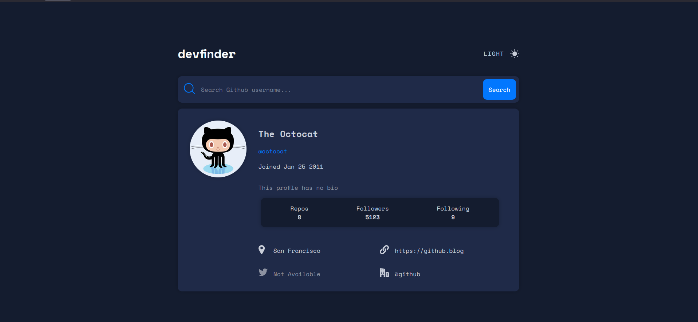
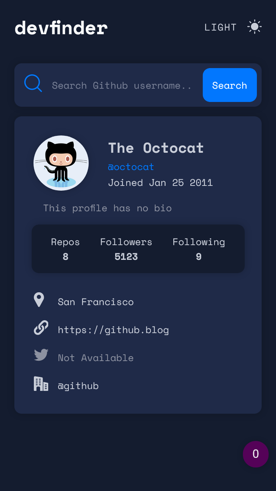

# Frontend Mentor - DevFinder solution

This is a solution to the [DevFinder challenge on Frontend Mentor](https://www.frontendmentor.io/challenges/github-user-search-app-Q09YOgaH6). Frontend Mentor challenges help you improve your coding skills by building realistic projects. 

## Table of contents

- [Frontend Mentor - DevFinder solution](#frontend-mentor---devfinder-solution)
  - [Table of contents](#table-of-contents)
  - [Overview](#overview)
    - [The challenge](#the-challenge)
    - [Screenshots](#screenshots)
    - [Links](#links)
  - [My process](#my-process)
    - [Built with](#built-with)
  - [Author](#author)

## Overview

### The challenge

Users should be able to:

- View the optimal layout for the app depending on their device's screen size
- See hover states for all interactive elements on the page
- Search for GitHub users by their username
- See relevant user information based on their search
- Switch between light and dark themes

### Screenshots

Desktop screenshot

Mobile screenshot

### Links

- Solution URL: [devfinder](https://github.com/Baptajck/devfinder)
- Live solution: [devfinder_live](https://baptajck.github.io/devfinder/)

## My process

### Built with

- Semantic HTML5 markup
- SCSS custom properties
- Flexbox
- Mobile-first workflow
- [ReactJS](https://reactjs.org/) library
- ViteJs
- Github API

## Author

- Website - [Baptjack](https://baptjack.fr)
- Frontend Mentor - [@baptjack](https://www.frontendmentor.io/profile/baptjack)
